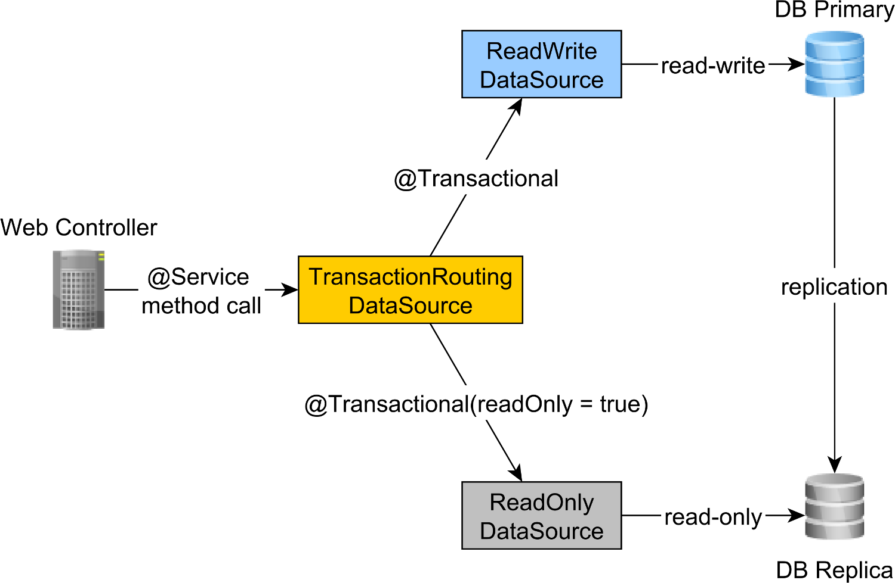

# spring5-read-replica-postgresql
This project targets legacy environments (JDK 8/11) that rely on Spring 5.x and javax-based APIs, offering an alternative to Spring 6 and Jakarta EE 9+ which require JDK 17 or higher.

Spring boot 2.7.18 (spring 5.3.31, last version for JDK 8/11) Proof of Concept for read write replicas on PostgreSQL.

## USEFUL FOR JDK 8 AND 11 APPLICATIONS (THAT FOR SOME REASON CANT BE UPGRADED TO JDK 17+ TO USE SPRING 6 / NEW SPEC JAKARTA EE & HIBERNATE 6)

# PS: On Hibernate 6, the LazyConnectionDataSourceProxy has a much simpler property to add a readOnly datasource, making ReplicationRoutingDataSource class unnecessary

Code architecture Credit (on Hibernate 6): [rajadilipkolli](https://github.com/rajadilipkolli/my-spring-boot-experiments/tree/main/jpa/boot-read-replica-postgresql)

This project is an example to show how we can separate read and write operations to primary and replica databases using spring boot and postgresql database.
A read replica in Postgres is a database instance that receives data from a primary database instance and serves it to clients. 
Read replicas are useful for scaling database workloads, as they can offload read operations from the primary instance, allowing it to focus on more resource-intensive tasks such as writing data. 
This can improve the performance of the overall database system. Read replicas can also be useful for providing high availability, as they can take over read operations if the primary instance becomes unavailable for any reason.

- All reads will go to reader instance and writes will go to writer instance
- Switching between master and replica can be observed in docker compose logs or application logs when datasourceproxy is enabled.

Architecture Image Credit : [Vlad](https://twitter.com/vlad_mihalcea)

---

## Key Concepts

1. **Primary-Replica Setup**: Writes go to the primary database, while reads occur on the replica.
2. **Performance Optimization**: Minimizes load on the primary, improving overall throughput.
3. **LazyConnectionDataSourceProxy**: Ensures a single `DataSource` bean but dynamically determines read vs. write at runtime.

### Reference
- (code base and instructions to run postgres master and replica on docker) https://github.com/rajadilipkolli/my-spring-boot-experiments/tree/main/jpa/boot-read-replica-postgresql 
- https://stackoverflow.com/questions/25911359/how-to-split-read-only-and-read-write-transactions-with-jpa-and-hibernate/26026237#26026237
